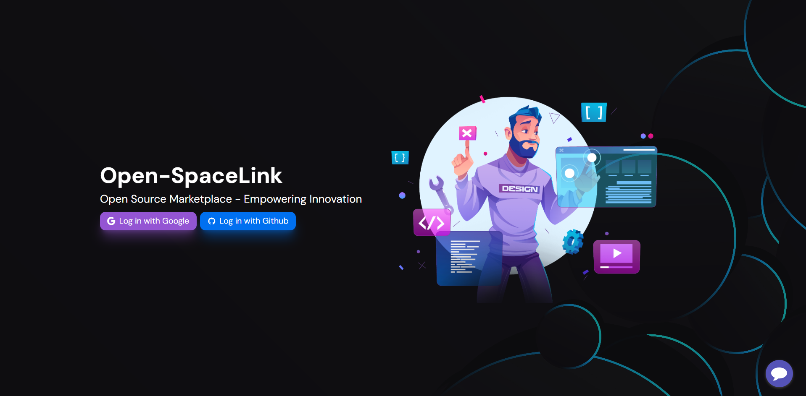
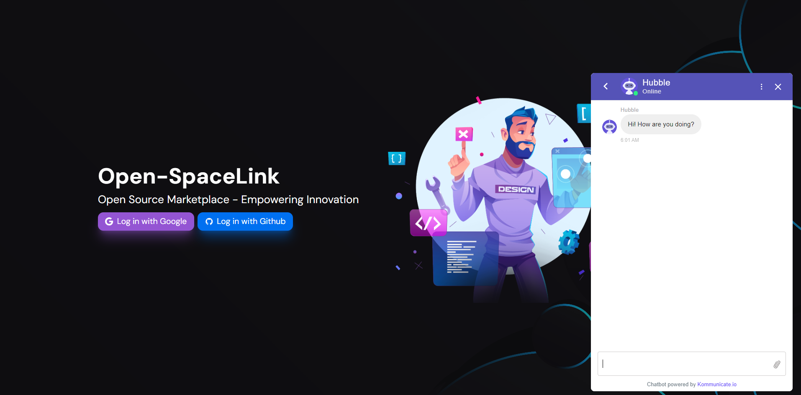

# Open Science Marketplace

**Project Owners:** Debugging Dynasty (NASA Apps Hackathon)




## Table of Contents

- [Description](#description)
- [Technologies Used](#technologies-used)
- [Mission](#mission)
- [Project Status](#project-status)
- [Why Use Our Platform?](#why-use-our-platform)
  - [1. Collaborate on Meaningful Projects](#1-collaborate-on-meaningful-projects)
  - [2. Promote Open Science Principles](#2-promote-open-science-principles)
  - [3. Enhance Skills and Knowledge](#3-enhance-skills-and-knowledge)
  - [4. Build a Network and Community](#4-build-a-network-and-community)
  - [5. Contribute to Open Source Initiatives](#5-contribute-to-open-source-initiatives)
  - [6. Influence the Future of Science](#6-influence-the-future-of-science)
- [Contact Details](#contact-details)
- [Local Setup](#local-setup)
- [How to Contribute](#how-to-contribute)
  - [Fork the Repository](#fork-the-repository)
  - [Clone the Repository](#clone-the-repository)
  - [Create a New Branch](#create-a-new-branch)
  - [Make Changes](#make-changes)
  - [Commit Changes](#commit-changes)
  - [Push Changes](#push-changes)
  - [Create a Pull Request](#create-a-pull-request)
  - [Code Review and Merge](#code-review-and-merge)

## Description

The Open Space Marketplace (Open-SpaceLink) is an innovative platform created by Debugging Dynasty during the NASA Apps Hackathon. This platform is designed to foster collaboration among researchers, scientists, and innovators while promoting openness and transparency in scientific exploration.

Key Features:

- **Innovative Collaboration:** The platform encourages collaboration among experts from diverse backgrounds, promoting creativity and learning from different perspectives.
- **Openness and Transparency:** Projects on the platform are conducted openly, providing access to raw data, methodologies, and results.
- **Empowering Researchers:** Researchers of all levels are encouraged to lead projects, share insights, and engage in discussions.

## Technologies Used

- **Frontend:** Next.js, NextUI, Tailwind CSS
- **Backend:** Appwrite
- **Version Control:** Git, GitHub
- **Deployment:** Vercel

## Mission

Our mission is to revolutionize research by promoting transparency, collaboration, and openness in scientific exploration.

## Project Status

The project's user interface (UI) is nearly finished, with a focus on keeping it simple and user-friendly. However, we are currently working on integrating more advanced GitHub features to enable the review of user-created pull requests (PRs). Due to certain technical challenges, the project is still in the prototype stage.

## Why Use Our Platform?

### 1. Collaborate on Meaningful Projects

- **Participate in Impactful Research:** Engage in projects that have a genuine impact on scientific fields, spanning from environmental science to cutting-edge technology.
- **Foster Cross-disciplinary Collaboration:** Collaborate with experts from diverse backgrounds, nurturing creativity and gaining insights from varied perspectives.

### 2. Promote Open Science Principles

- **Champion Transparency and Openness:** Embrace the ethos of open science by getting involved in projects dedicated to transparency. Gain access to raw data, methodologies, and contribute openly.
- **Advocate for Positive Change:** Join a community that actively advocates for open access, reproducibility, and democratizing knowledge.

### 3. Enhance Skills and Knowledge

- **Advance Professionally:** Hone your skills and acquire hands-on experience by collaborating with experienced researchers and fellow contributors.
- **Continuous Learning:** Engage in discussions, workshops, and webinars to enrich your knowledge across diverse scientific domains.

### 4. Build a Network and Community

- **Join a Global Community:** Become a valued member of a diverse global community of researchers and innovators. Connect, learn, and collaborate with like-minded individuals.
- **Gain Community Recognition:** Receive recognition for your contributions, establishing your reputation within and beyond the community.

### 5. Contribute to Open Source Initiatives

- **Engage in Open Source Collaboration:** Contribute to open-source tools and projects, strengthening your portfolio and showcasing your expertise to a wider audience.
- **Create a Positive Impact:** Contribute to the open-source movement, fostering collaborative development for the greater good.

### 6. Influence the Future of Science

- **Embrace Innovation and Creativity:** Be part of a community that highly values innovative thinking. Your ideas and contributions can help shape the future of scientific research and technology.
- **Make a Global Impact:** Contribute to projects that tackle global challenges, positively affecting society, the environment, and technological progress.

## Contact Details

- Mansi Dixit: 23dixitmansi@gmail.com
- Deepanshu Goel: symaticvisuals02@gmail.com
- Chandan Kumar: mishr0404@gmail.com
- Unnati Yadav: yadavunnati816@gmail.com

## Local Setup

To set up the project locally, follow these steps:

1. **Clone the Repository**

- Clone the project repository to your local machine:
  ```
  git clone https://github.com/symaticvisuals/open-devlink.git
  ```

2. **Install Dependencies**

- Navigate to the project directory and install the required dependencies:
  ```
  cd open-devlink
  npm install
  ```

3. **Set Up Appwrite**

- Create an account on Appwrite and set up a new project.
- Obtain the Appwrite API keys and configure them in the project.

4. **Start the Development Server**

- Start the Next.js development server:
  ```
  npm run dev
  ```

5. **Create a env file**

- It will contain the following variables

  ```
  NEXT_PUBLIC_APPWRITE_ENDPOINT=https://appwrite.io/v1
  NEXT_PUBLIC_APPWRITE_PROJECT=YOUR_PROJECT_ID
  NEXT_PUBLIC_WEBSITE_DOMAIN=http://localhost:3000/
  ```

5. **Access the Application**

- Open your web browser and access the application at `http://localhost:3000`.

Now, you have the Open Science Marketplace running locally on your machine for development and testing purposes.

## How to Contribute

1. **Fork the Repository**

   - Click on the "Fork" button at the top right of the repository page. This creates your own copy of the repository.

2. **Clone the Repository**

   - Clone the forked repository to your local machine using the following command: GitHub_link

3. **Create a New Branch**

   - Create a new branch for your changes: `git checkout -b feature-branch-name`

4. **Make Changes**

   - Make your changes, fix bugs, or add new features. Ensure your changes adhere to the project's coding guidelines.

5. **Commit Changes**

   - Commit your changes with clear and concise messages: `git commit -m "Description of changes made"`

6. **Push Changes**

   - Push your changes to your forked repository on GitHub: `git push origin feature-branch-name`

7. **Create a Pull Request**
   - Go to your forked repository on GitHub.
   - Click on the "New Pull Request" button.
   - Select the branch with your changes in the "base repository."
   - Provide a descriptive title and explain your changes in the comment box.
   - Click "Create Pull Request" to submit your changes for review.

## Code Review and Merge

Once your pull request is submitted, it will be reviewed by the project maintainers. Be prepared to address feedback and make necessary changes. Your pull request will be merged into the main project once it meets the project's standards and guidelines.
