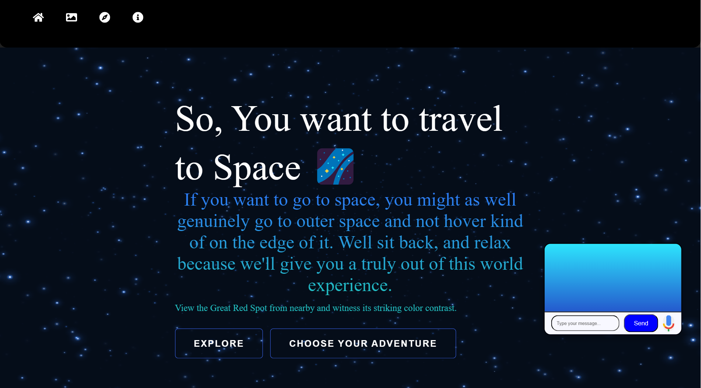
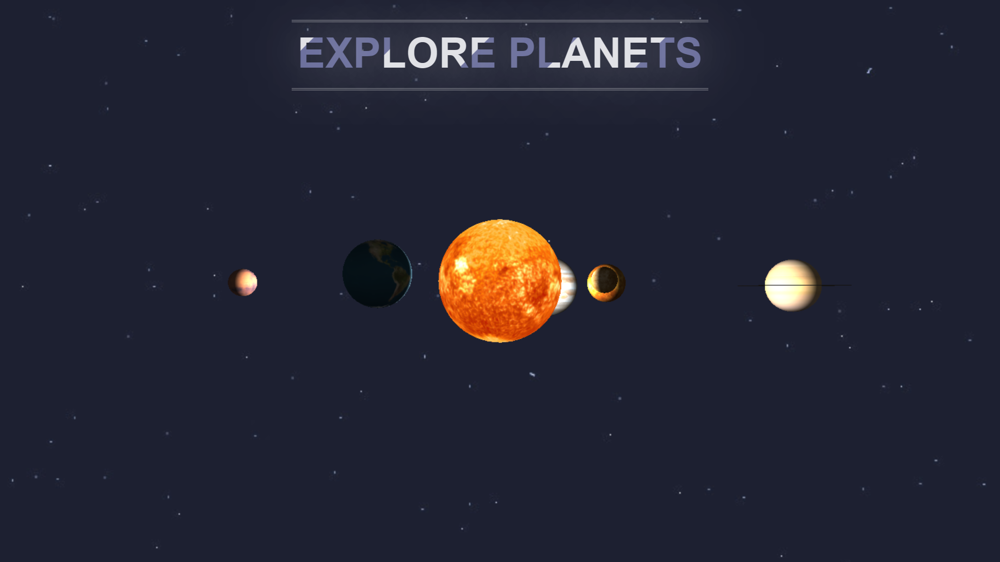
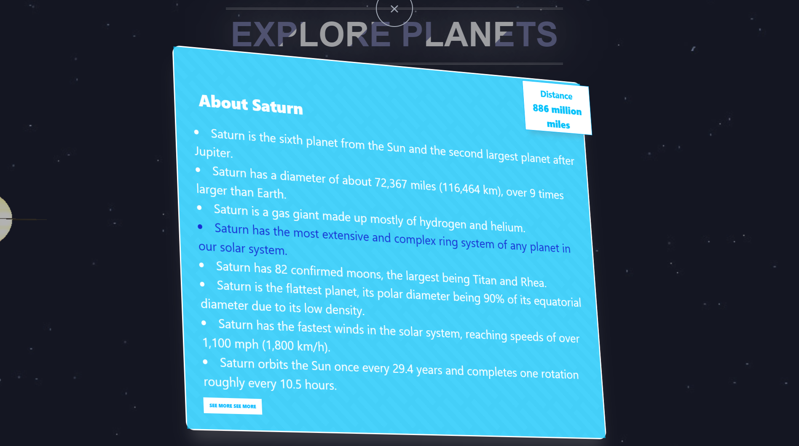
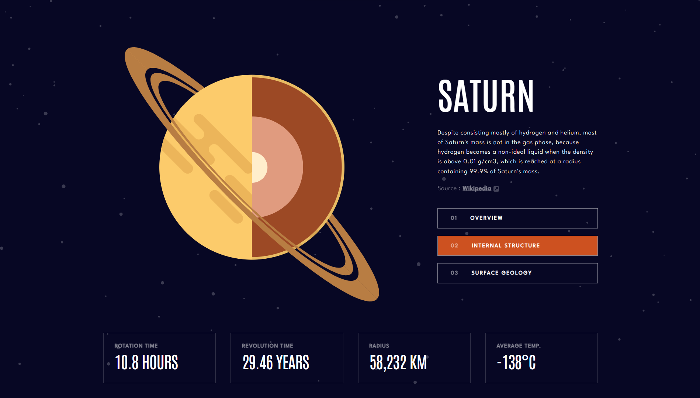
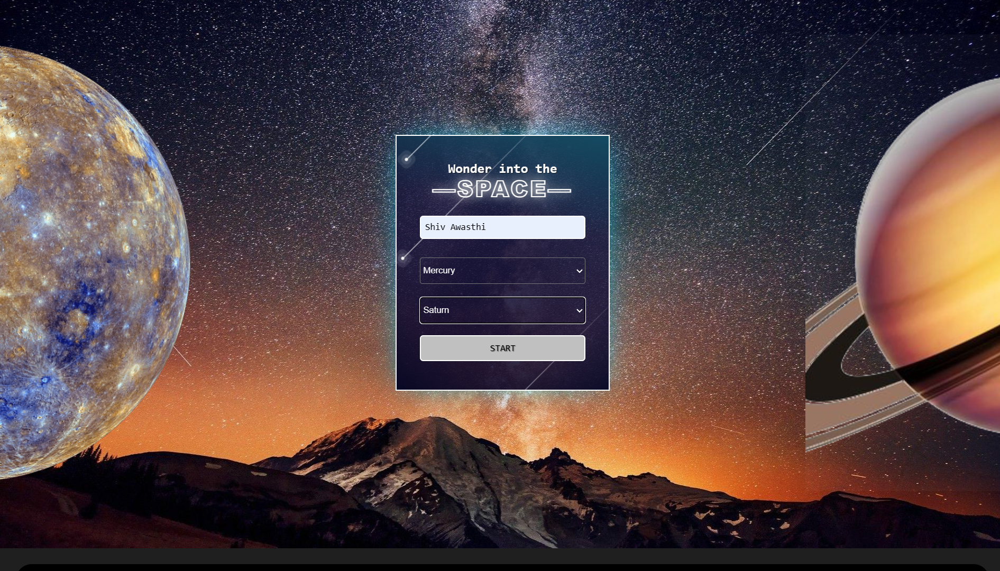
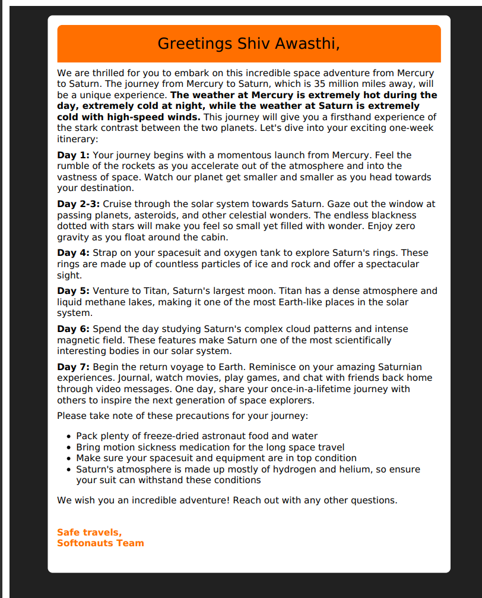

# Planetary Tourism Office
## Team

- Team Name: Softonauts
- Team Leader Namer: Aviral Kaintura
- Email Id: provantablack@gmail.com

## Check out Website!:
 https://softonauts.netlify.app
 
## Description

The Planetary Tourism Office project is a website that allows users to explore planets and gain knowledge about space travel from the comfort of their homes. It provides an interactive platform for users to check itineraries and learn about the planets in our solar system.

Using React, Vite, and Tailwind CSS, the project offers a user-friendly interface with responsive design. Users can navigate through the website to access information about different planets, view interactive 3D models, and plan their own virtual space travel itineraries.

The project integrates with the NASA API to provide real-time data about the planets, ensuring that users have access to the latest information. Additionally, custom AI algorithms are implemented to offer personalized recommendations based on user preferences and behavior.

With the inclusion of 3D models, CSS, HTML, and generative AI techniques, the website creates an immersive experience that sparks curiosity and allows users to gain knowledge about space exploration.
## ScreenShots

## Technologies Used

- React
- Vite
- Tailwind CSS
- Three.js
- Flask
- Custom AI
- NASA API
- CSS
- HTML
- 3D Models
- Generative AI

## Features

- Interactive 3D models of planets
- Itinerary planning for space travel
- Access to NASA API for real-time data
- Custom AI for personalized recommendations
- User-friendly interface with responsive design

## Installation

1. Clone the repository: git clone <repository-url>
2. Install dependencies: npm install
3. Start the development server: npm run dev

## Usage

1. Open the project in your preferred code editor.
2. Configure the necessary API keys and settings.
3. Run the development server.
4. Access the website in your browser.

## Contributing

Contributions are welcome! If you'd like to contribute to the project, please follow these steps:

1. Fork the repository.
2. Create a new branch for your feature or bug fix.
3. Make your changes and commit them.
4. Push your changes to your forked repository.
5. Submit a pull request to the main repository.

## Acknowledgements

- [NASA API](https://api.nasa.gov/) for providing space-related data.
- [Tailwind CSS](https://tailwindcss.com/) for the responsive design.
- [Three.js](https://threejs.org/) for the interactive 3D models.

## Contact

For any questions or inquiries, please contact [provantablack@gmail.com](mailto:provantablack@gmail.com).
